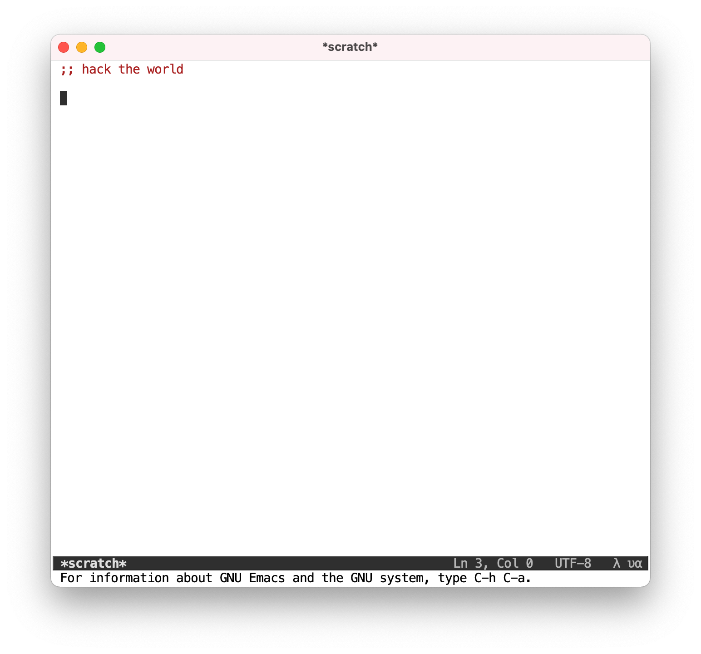

# emacs.d
Modernized notepad for taking notes and for checking hypothesis.

## Installation
Get latest version of emacs. If you are a mac os user, you can use [homebrew](https://brew.sh) to install it.

```bash
brew cask install emacs
```

Clone emacs settings to home directory.
```bash
git clone https://github.com/sullenor/emacs.d.git ~/.emacs.d
```

Enjoy 😉

## Preview


## Todos
Interface:
- Improve modeline:
  - Open list of buffers by tapping on buffer name
  - Open popular modes list by taggping on mode name
- Update `mc/edit-ends-of-lines` not to capture cursor on the next line.
- Move initial `.mc-lists.el` to init file. Move `.mc-lists.el` to `~/.local/share/emacs`.
- Show directory in window title and omit it from modeline.
- Embed light theme customization.

Modes:
- Fix extra indent after ( in sql-mode.
- Tweak auto-formatting for particular modes.
- Add extra folder for snippets.
